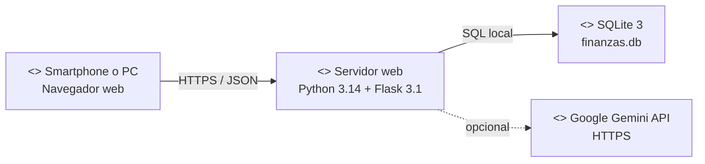
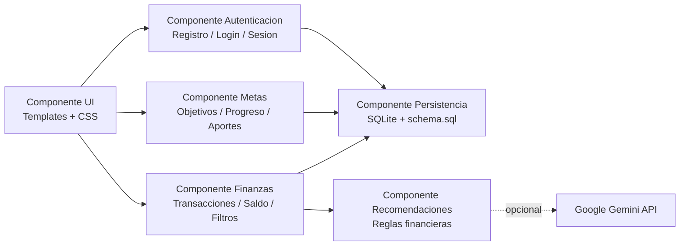
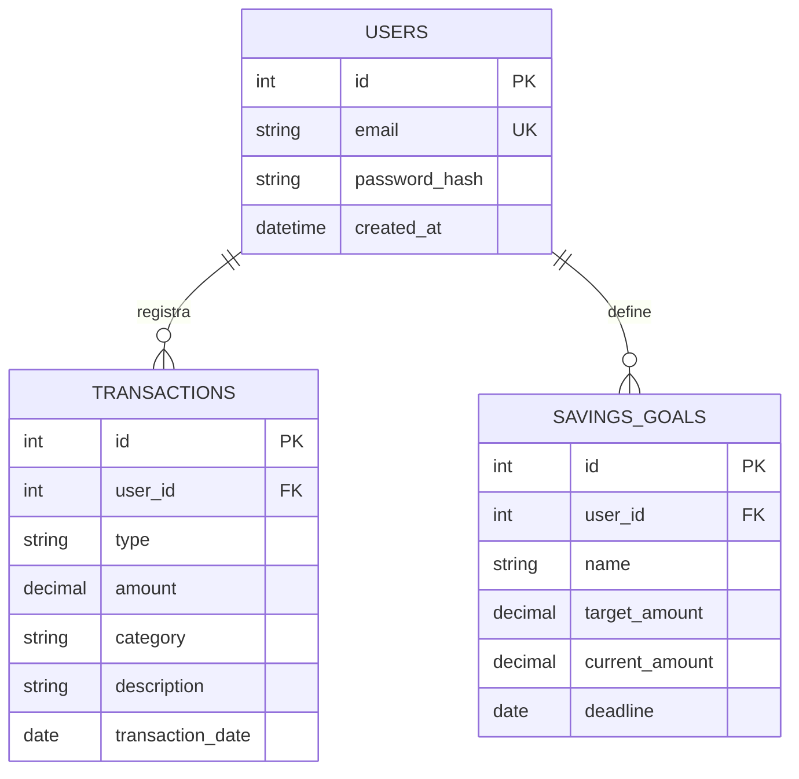

# Entrega 2 - Diseno de solucion y preview de funcionalidad

## Proyecto: AhorraU

AhorraU es una aplicacion web de finanzas personales para estudiantes universitarios. La preview implementa autenticacion, registro de ingresos y egresos, calculo de saldo, categorias, recomendaciones basicas y metas de ahorro.

## 1. Arquitectura y datos

### 1.1 Diagrama de despliegue

| Nodo | Tecnologia | Responsabilidad |
|---|---|---|
| Dispositivo cliente | Navegador moderno, HTML5, CSS3, JavaScript | Interfaz responsive y captura de datos |
| Servidor web | Python 3.14, Flask 3.1.1, Werkzeug | Rutas, sesiones, validacion y reglas de negocio |
| Persistencia | SQLite 3 | Usuarios, transacciones y metas con claves foraneas |
| Servicio externo opcional | Google Gemini API | Recomendaciones de lenguaje natural cuando exista `GEMINI_API_KEY` |
| Red | HTTPS/TLS en despliegue | Proteccion de datos en transito |

### 1.2 Diagrama de componentes

| Componente | Descripcion |
|---|---|
| UI | Renderiza landing, autenticacion y dashboard; adapta la vista a movil y escritorio. |
| Autenticacion | Registra usuarios, hashea contrasenas y controla la sesion activa. |
| Finanzas | Valida y persiste ingresos y egresos; calcula saldo y gastos por categoria. |
| Metas | Crea objetivos, registra aportes y calcula el porcentaje de progreso. |
| Persistencia | Aplica el esquema relacional y restricciones de integridad. |
| Recomendaciones | Genera una sugerencia basada en saldo, egresos y categoria dominante. |

### 1.3 Modelo relacional

Reglas: todo movimiento y toda meta pertenece a un usuario; los montos son positivos; `type` solo acepta `income` o `expense`; eliminar un usuario elimina sus datos dependientes.

## 2. Mockups y preview

### Vista landing
- **Que:** propuesta de valor, nombre AhorraU y llamados a crear cuenta o iniciar sesion.
- **Donde:** hero principal con tarjeta de saldo visual.
- **Como:** botones llevan a los formularios de autenticacion.

### Vista dashboard
- **Que:** saldo, ingresos, gastos, actividad reciente, insight y metas.
- **Donde:** metricas arriba; movimientos e insight al centro; formularios al final.
- **Como:** formularios POST registran transacciones y crean metas sin salir del dashboard.

### Vista autenticacion
- **Que:** correo y contrasena.
- **Donde:** panel central con un solo flujo.
- **Como:** validacion de correo, contrasena minima de 8 caracteres y mensajes de estado.

## 3. Repositorio

El repositorio debe contener este proyecto, `requirements.txt`, `README.md`, `schema.sql`, codigo, pruebas y la pagina Wiki. Cada integrante debe aportar al menos un commit descriptivo desde su usuario GitHub.

## 4. Video (guion de 4:00 a 5:00)

1. **Pitch - 1:00:** integrantes, nombre AhorraU, problema de desorden financiero estudiantil, solucion y estado actual: preview funcional con autenticacion, movimientos, saldo, recomendaciones y metas.
2. **Explicacion - 2:00:** mostrar FR01-FR06 (cuenta, login, ingreso, egreso, listado y saldo), FR14-FR15 (metas) y FR18 (recomendacion); explicar que cada accion responde a una necesidad del estudiante.
3. **Evidencia - 2:00:** crear una cuenta, registrar ingreso, registrar egreso, mostrar saldo y categoria, crear una meta, revisar que la informacion persiste al recargar. Todos los integrantes aparecen en algun momento.

**Enlace:** pendiente de publicar en YouTube o Vimeo.

## 5. Gestion del proyecto

### Top 10 requisitos para Sprint 2

| Prioridad | Requisito | Estado | Responsable |
|---:|---|---|---|
| 1 | FR01 Crear cuenta | Implementado | Asignar |
| 2 | FR02 Iniciar sesion | Implementado | Asignar |
| 3 | FR04 Registrar ingreso | Implementado | Asignar |
| 4 | FR05 Registrar egreso | Implementado | Asignar |
| 5 | FR06 Consultar transacciones | Implementado | Asignar |
| 6 | FR09 Calcular saldo | Implementado | Asignar |
| 7 | FR14 Crear meta | Implementado | Asignar |
| 8 | FR15 Consultar progreso | Implementado | Asignar |
| 9 | FR18 Recomendaciones | Implementado local; Gemini pendiente | Asignar |
| 10 | UR05 Contraste WCAG AA | Implementado visualmente; auditar | Asignar |

### Reuniones semanales

| Semana | Que hicimos | Que haremos | Obstaculos |
|---|---|---|---|
| 1 | Definimos usuarios, problema y requisitos | Implementar modelo y autenticacion | Confirmar responsables |
| 2 | Construimos arquitectura y modelo relacional | Integrar dashboard y metas | Disponibilidad del equipo |
| 3 | Validamos flujo principal y pruebas | Grabar video y publicar Wiki | Agendar grabacion |

### Retrospectiva Sprint 2

- **Continuar:** commits pequenos y descriptivos, validacion temprana y decisiones documentadas.
- **Empezar:** revisar el tablero al inicio de cada reunion y asignar responsable por requisito.
- **Detener:** acumular cambios sin integrar y dejar evidencias para el ultimo dia.

### Asignaciones de clase

Agregar aqui los enlaces o archivos de cada asignacion solicitada por el curso, manteniendo una seccion por actividad.
